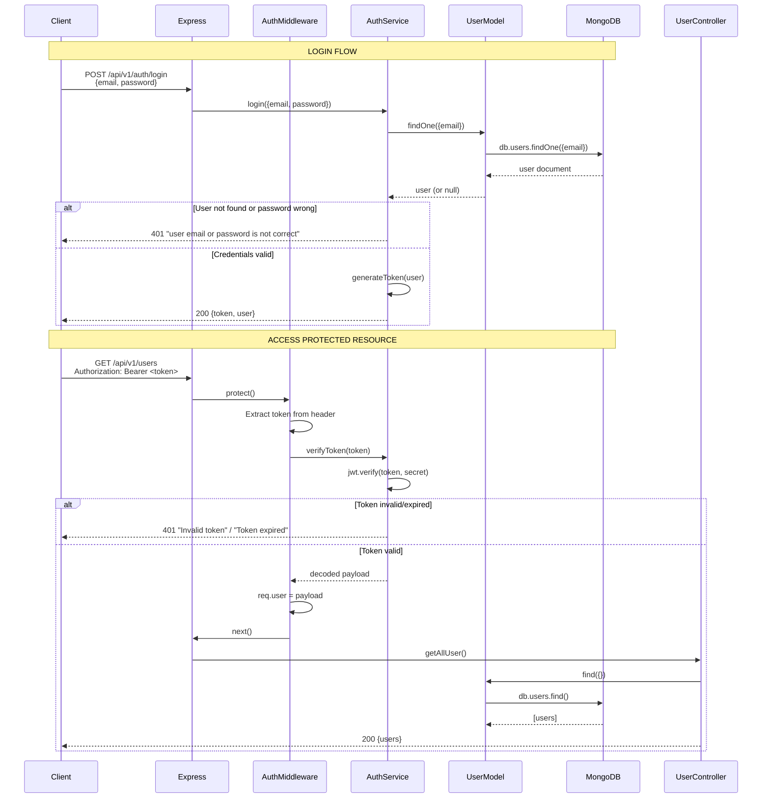
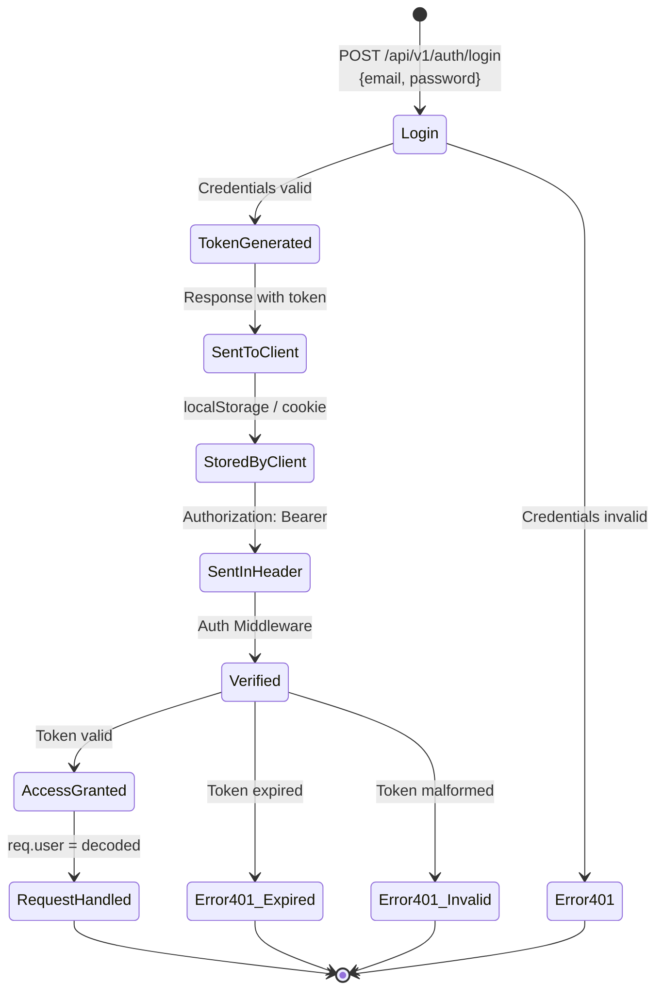

# Authentication System - Documentation

## Overview

A Node.js/Express authentication system using JWT (JSON Web Tokens) with Bearer token scheme, MongoDB for persistence, and bcrypt for password hashing.

**Current Status:** Login-only with Bearer Auth JWT (learning phase)

---

## Architecture

```
Client  -->  Express App  -->  Routes  -->  Middleware  -->  Controllers  -->  Services  -->  Models  -->  MongoDB
```

### Project Structure

```
├── config/
│   ├── DB.js                  # MongoDB connection
│   └── key.js                 # Environment variable exports
├── controllers/
│   ├── auth.controller.js     # Login endpoint handler
│   ├── error.controller.js    # Global error handler
│   └── user.controller.js     # User CRUD handlers
├── middlewares/
│   └── auth.middleware.js     # JWT verification (protect)
├── models/
│   ├── user.model.js          # User schema + password hashing
│   └── comment.model.js       # Comment schema (placeholder)
├── routes/
│   ├── auth.routes.js         # POST /login
│   ├── user.routes.js         # GET /users (protected)
│   └── comment.routes.js      # Empty (placeholder)
├── services/
│   └── auth.service.js        # Token generation, verification, login logic
├── utils/
│   ├── AppError.js            # Custom error class
│   └── catchAsync.js          # Async error wrapper
├── app.js                     # Express app setup
├── server.js                  # Server entry point
└── .env                       # Environment variables
```

---

## What Is Implemented (Current State)

### 1. User Model (`models/user.model.js`)

| Field       | Type    | Details                          |
|-------------|---------|----------------------------------|
| firstName   | String  | Required, trimmed                |
| secondName  | String  | Required, trimmed                |
| email       | String  | Required, unique, validated      |
| password    | String  | Required, trimmed                |
| role        | String  | Enum: `user`, `admin` (default: `user`) |
| isVerified  | Boolean | Default: `false`                 |
| timestamps  | Auto    | `createdAt`, `updatedAt`         |

**Virtual:** `userName` - concatenates `firstName + secondName`

**Method:** `comparePassword(candidatePassword)` - bcrypt compare

### 2. Auth Service (`services/auth.service.js`)

| Method         | Purpose                                      |
|----------------|----------------------------------------------|
| `login()`      | Validates credentials, returns JWT + user    |
| `generateToken()` | Signs JWT with userId, username, email, role |
| `verifyToken()`   | Verifies JWT, handles expired/invalid tokens |
| `decodeToken()`   | Decodes JWT without verification             |

**JWT Payload:**
```json
{
  "userId": "ObjectId",
  "username": "John Doe",
  "email": "john@example.com",
  "role": "user",
  "iat": 1234567890,
  "exp": 1234567890,
  "iss": "Auth-System"
}
```

### 3. Auth Middleware (`middlewares/auth.middleware.js`)

**`protect`** - Extracts Bearer token from `Authorization` header, verifies it, attaches decoded payload to `req.user`.

### 4. Routes

| Method | Endpoint           | Auth Required | Handler                |
|--------|--------------------|---------------|------------------------|
| POST   | `/api/v1/auth/login` | No          | `authController.login` |
| GET    | `/api/v1/users`    | Yes (protect) | `userController.getAllUser` |

### 5. Error Handling

- `AppError` class for operational errors (status codes 4xx/5xx)
- `catchAsync` wrapper to avoid try/catch in every controller
- Global error handler in `error.controller.js`

---

## Current Flow: Login with Bearer Auth JWT



---

## JWT Token Lifecycle



---

## Security Analysis

### What's Done Right

- Password hashing with bcrypt (via `comparePassword`)
- JWT with expiration (`JWT_EXPIRES_IN=24h`)
- Separate `AuthService` class for logic separation
- `catchAsync` to prevent unhandled promise rejections
- Environment variables for secrets
- Email validation via `validator` library

### Bugs Found

None currently - previously fixed:
- `AppError.js:4` - Fixed: `this.statusCode = statusCode;`
- `getAllUser` - Fixed: Uses DTO (`userDTO.formatAllUsers`) which excludes password

### Security Concerns (Current Code)

1. **No rate limiting** - Login endpoint is vulnerable to brute-force attacks.
2. **No rate limiting** - Login endpoint is vulnerable to brute-force attacks.
3. **JWT secret in `.env`** - Make sure `.env` is in `.gitignore`.
4. **No token blacklisting** - Logged-out tokens remain valid until expiry.
5. **No refresh token** - User must re-login after token expires.
6. **`isVerified` field unused** - You have it but don't check it during login.

---

## Production Best Practices

| Practice                      | Status      | Notes                                      |
|-------------------------------|-------------|--------------------------------------------|
| HTTPS                         | Not done    | Must use in production (Helmet + reverse proxy) |
| Rate Limiting                 | Not done    | Add `express-rate-limit` on auth routes    |
| Helmet (security headers)     | Not done    | `app.use(helmet())`                        |
| CORS                          | Not done    | Configure allowed origins                  |
| Input Sanitization            | Partial     | Using `validator` but no sanitization      |
| CSRF Protection               | Not done    | Needed if using cookies                    |
| Password Complexity Rules     | Not done    | Enforce min length, strength               |
| Account Lockout               | Not done    | After N failed attempts                    |
| Email Verification            | Not done    | `isVerified` field exists but unused       |
| Refresh Tokens                | Not done    | For seamless session management            |
| Token Blacklisting            | Not done    | For proper logout                          |
| Audit Logging                 | Not done    | Track login attempts, IP, user agent       |

---

## Checklist: Complete AuthN & AuthZ System

### Phase 1: Fix Current Issues

- [x] Fix bug in `AppError.js`: `this.statusCode = statusCode;`
- [x] Exclude password from user queries (using DTO `formatAllUsers`)
- [ ] Add `.gitignore` for `.env`, `node_modules`

### Phase 2: Authentication (AuthN) - Core

- [ ] **Registration / Signup**
  - [ ] Create `POST /api/v1/auth/register` endpoint
  - [ ] Validate input (name, email, password)
  - [ ] Enforce password complexity (min 8 chars, uppercase, number, symbol)
  - [ ] Hash password with bcrypt before saving
  - [ ] Prevent duplicate email registration
  - [ ] Auto-login after registration (return JWT)

- [ ] **Email Verification**
  - [ ] Generate verification token on registration
  - [ ] Send verification email (use Nodemailer + SendGrid/Mailgun)
  - [ ] Create `GET /api/v1/auth/verify-email/:token` endpoint
  - [ ] Set `isVerified: true` on verification
  - [ ] Block login for unverified accounts (optional)

- [ ] **Password Reset (Forgot Password)**
  - [ ] Create `POST /api/v1/auth/forgot-password` endpoint
  - [ ] Generate reset token (JWT or crypto random)
  - [ ] Send reset email with token link
  - [ ] Create `PATCH /api/v1/auth/reset-password/:token` endpoint
  - [ ] Invalidate old tokens after reset

- [ ] **Change Password (Logged-in User)**
  - [ ] Create `PATCH /api/v1/auth/change-password` endpoint
  - [ ] Require current password verification
  - [ ] Invalidate old JWT after password change

### Phase 3: Authorization (AuthZ)

- [ ] **Role-Based Access Control (RBAC)**
  - [ ] Create `restrictTo(...roles)` middleware
  - [ ] Apply to admin-only routes (e.g., `DELETE /users/:id`)
  - [ ] Prevent privilege escalation (user can't self-promote to admin)

- [ ] **Resource Ownership**
  - [ ] Users can only edit/delete their own comments
  - [ ] Admins can edit/delete any resource
  - [ ] Add ownership check middleware

### Phase 4: Token Management

- [ ] **Refresh Token**
  - [ ] Issue refresh token alongside access token
  - [ ] Store refresh token in HTTP-only cookie
  - [ ] Create `POST /api/v1/auth/refresh` endpoint
  - [ ] Implement refresh token rotation

- [ ] **Logout / Token Revocation**
  - [ ] Create `POST /api/v1/auth/logout` endpoint
  - [ ] Implement token blacklisting (Redis recommended)
  - [ ] Clear refresh token cookie on logout

- [ ] **Token Expiry Strategy**
  - [ ] Short-lived access token (15min - 1hr)
  - [ ] Long-lived refresh token (7-30 days)
  - [ ] Implement sliding window expiration

### Phase 5: Security Hardening

- [ ] **Rate Limiting**
  - [ ] Install `express-rate-limit`
  - [ ] Apply strict limits on login/register (e.g., 5 req/15min per IP)
  - [ ] Apply general rate limit on all routes

- [ ] **Security Headers**
  - [ ] Install `helmet`
  - [ ] `app.use(helmet())`

- [ ] **CORS**
  - [ ] Install `cors`
  - [ ] Configure allowed origins, methods, headers

- [ ] **Input Sanitization**
  - [ ] Install `express-mongo-sanitize` (prevent NoSQL injection)
  - [ ] Install `xss-clean` (prevent XSS)
  - [ ] Validate all inputs with `express-validator` or `joi`

- [ ] **CSRF Protection**
  - [ ] If using cookies: install `csurf` or use double-submit cookie pattern

- [ ] **HTTPS**
  - [ ] Enforce HTTPS in production (redirect HTTP to HTTPS)
  - [ ] Use `secure: true` on cookies

### Phase 6: OAuth / Social Login (Optional)

- [ ] Google OAuth (Passport.js + Google Strategy)
- [ ] GitHub OAuth
- [ ] Facebook OAuth
- [ ] Link social accounts to local accounts

### Phase 7: Testing

- [ ] Unit tests for AuthService (token generation, verification)
- [ ] Integration tests for auth routes
- [ ] Test password hashing/verification
- [ ] Test protected routes without/with invalid tokens
- [ ] Test role-based access control
- [ ] Test rate limiting behavior

### Phase 8: Production Readiness

- [ ] Environment-specific configs (dev/staging/prod)
- [ ] Database indexing (email, reset tokens)
- [ ] Logging (Winston or Pino)
- [ ] Monitoring (health check endpoint)
- [ ] Graceful shutdown handling
- [ ] API documentation (Swagger/OpenAPI)

---

## Tech Stack

| Tool           | Purpose                    |
|----------------|----------------------------|
| Express.js     | HTTP framework             |
| MongoDB        | Database                   |
| Mongoose       | ODM for MongoDB            |
| bcrypt         | Password hashing           |
| jsonwebtoken   | JWT creation/verification  |
| cookie-parser  | Cookie parsing             |
| validator      | Input validation           |
| morgan         | HTTP request logging       |
| dotenv         | Environment variables      |

---

## Quick Reference: Current API

### Login
```bash
curl -X POST http://localhost:3001/api/v1/auth/login \
  -H "Content-Type: application/json" \
  -d '{"email": "john@example.com", "password": "secret123"}'
```

### Get Users (Protected)
```bash
curl http://localhost:3001/api/v1/users \
  -H "Authorization: Bearer <your-token>"
```
