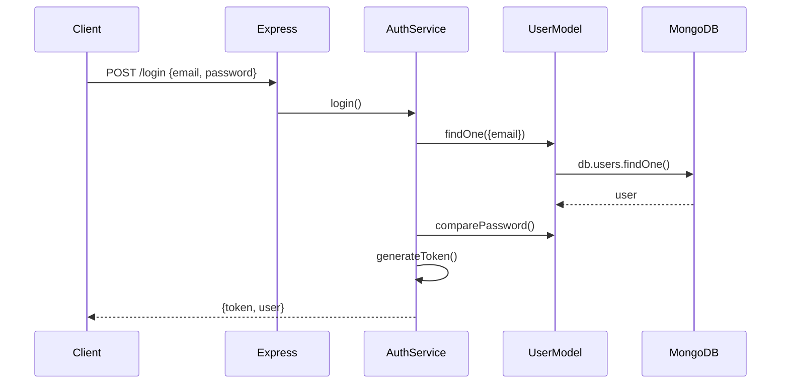
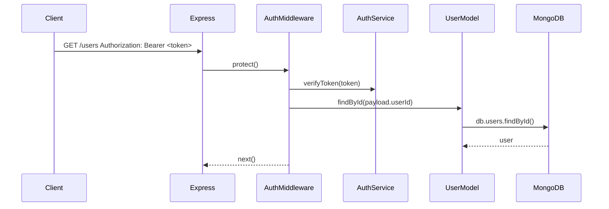

# Authentication System Learning Guide

This document explains authentication, authorization, OAuth, and auth security in a way that matches this project.

It is written for learning, so it focuses on:

- What each concept means
- How the request flow works
- What code patterns are used
- What you already have in the project
- What you can build next

---

## Table of Contents

1. [What This Project Already Does](#what-this-project-already-does)
2. [AuthN: Authentication](#authn-authentication)
3. [AuthZ: Authorization](#authz-authorization)
4. [OAuth](#oauth)
5. [Auth Security](#auth-security)
6. [Current Project Flow](#current-project-flow)
7. [Code Patterns You Can Reuse](#code-patterns-you-can-reuse)
8. [What To Learn Next](#what-to-learn-next)

---

## What This Project Already Does

Your current code already has a working base:

- User model
- Password hashing with `bcrypt`
- Login with JWT
- Token verification middleware
- Protected routes with `protect`
- Service-based auth logic
- DTO-based response shaping

That means this is already a real auth foundation, not just a demo folder.

### Current Files Involved

- `models/user.model.js`
- `services/auth.service.js`
- `controllers/auth.controller.js`
- `middlewares/auth.middleware.js`
- `routes/auth.routes.js`

---

## AuthN: Authentication

Authentication means:

> Who are you?

It is the process of proving identity.

### Common Authentication Methods

1. Email and password
2. OTP or email verification
3. Magic link
4. JWT login
5. Session login
6. OAuth login with Google or GitHub
7. Biometric login in mobile apps

### In This Project

You currently use:

- Email + password login
- JWT for identity proof
- `protect` middleware for checking the token

---

### 1. Basic Email + Password Authentication

This is the most common beginner auth flow.

#### Flow

1. User sends email and password
2. Server looks up the user in the database
3. Server compares the password using `bcrypt`
4. Server creates a JWT
5. Client stores the token
6. Client sends the token with later requests

#### Example Code

```js
const user = await User.findOne({ email }).select('+password');

if (!user) {
  throw new Error('Invalid credentials');
}

const isMatch = await user.comparePassword(password);

if (!isMatch) {
  throw new Error('Invalid credentials');
}

const token = AuthService.generateToken(user);

res.json({
  token,
  user,
});
```

#### Why This Works

- The user proves identity with a secret they know
- The database does not store the plain password
- The token proves identity on future requests

---

### 2. Password Hashing

Never store a plain text password.

#### Example

```js
userSchema.pre('save', async function () {
  this.password = await bcrypt.hash(this.password, 12);
});
```

#### Why

- If the database leaks, raw passwords are not exposed
- `bcrypt` is slow by design, which helps against brute-force attacks
- Hashing is one of the most important auth protections

---

### 3. Login With JWT

JWT means JSON Web Token.

It is a compact token that proves the user was authenticated.

#### JWT Parts

```text
header.payload.signature
```

#### Example Payload

```js
{
  userId: '66abc123...',
  username: 'John Doe',
  email: 'john@example.com',
  role: 'user'
}
```

#### Example Token Creation

```js
static generateToken(user) {
  const payload = {
    userId: user.id,
    username: user.userName,
    email: user.email,
    role: user.role,
  };

  return jwt.sign(payload, JWT_SECRET, {
    expiresIn: JWT_EXPIRES_IN,
    issuer: 'Auth-System',
  });
}
```

#### Why

- The token proves the user is logged in
- The server does not need a session store for every request
- JWT is useful for APIs, SPAs, and mobile apps

---

### 4. Registration / Signup

Signup is also part of authentication because it creates the identity first.

#### What Signup Should Do

- Accept name, email, password
- Validate input
- Reject duplicate email
- Hash the password
- Save the user

#### Example

```js
const existing = await User.findOne({ email });

if (existing) {
  throw new Error('Email already exists');
}

const newUser = await User.create({
  firstName,
  secondName,
  email,
  password,
});
```

#### Why

- Without signup, new users cannot join
- Signup is the start of the auth lifecycle

---

### 5. Email Verification

Email verification is still authentication because it helps confirm the identity and ownership of the email.

#### Why It Exists

- Stops fake accounts
- Confirms the email belongs to the user
- Gives trust before login or sensitive actions

#### Common Approaches

1. OTP code
2. Verification link
3. Signed token

#### OTP Example

```js
const otp = Math.floor(100000 + Math.random() * 900000).toString();

user.verificationCode = otp;
user.verificationExpires = Date.now() + 10 * 60 * 1000;
await user.save();
```

#### Verify Endpoint Example

```js
const { email, otp } = req.body;

const user = await User.findOne({ email });

if (!user) {
  throw new Error('User not found');
}

if (user.verificationCode !== otp) {
  throw new Error('Invalid verification code');
}

if (user.verificationExpires < Date.now()) {
  throw new Error('Verification code expired');
}

user.isVerified = true;
user.verificationCode = undefined;
user.verificationExpires = undefined;
await user.save();
```

#### Why

- Makes the account more trustworthy
- Helps with password reset and recovery later
- Makes the auth system closer to production style

---

### 6. Current Login Flow in This Project

Your current flow is:

1. User sends email and password
2. Server finds the user
3. Password is checked with `bcrypt`
4. JWT is created
5. Client stores the token
6. Client sends token in `Authorization` header

#### Example

```js
const authHeader = req.headers.authorization;
const token = authHeader && authHeader.split(' ')[1];

if (!token) {
  throw new Error('Not logged in');
}

const payload = AuthService.verifyToken(token);
req.user = payload;
next();
```

---

## AuthZ: Authorization

Authorization means:

> What are you allowed to do?

It comes after authentication.

### Common Authorization Patterns

1. Role-based access control
2. Ownership checks
3. Permission checks
4. Route guards
5. Feature access checks

### In This Project

You already have:

- `role` on the user model
- `protect` middleware

You do not yet have full authorization logic, but the model is ready for it.

---

### 1. Role-Based Authorization

Role-based auth means you allow or deny actions based on the user role.

#### Example

```js
const restrictTo = (...roles) => {
  return (req, res, next) => {
    if (!roles.includes(req.user.role)) {
      throw new Error('Forbidden');
    }
    next();
  };
};
```

#### Example Route

```js
router.delete('/users/:id', protect, restrictTo('admin'), deleteUser);
```

#### Why

- Admin tasks should not be available to everyone
- Keeps the system safer
- Makes permissions explicit

---

### 2. Ownership Checks

Ownership checks mean the user can only act on resources they own.

#### Example

```js
if (req.user.id !== comment.userId.toString()) {
  throw new Error('You do not own this resource');
}
```

#### Real Examples

- User edits only their own profile
- User deletes only their own comment
- User views only their own orders

#### Why

- Prevents one user from modifying another user’s data
- This is one of the most important real-world authz rules

---

### 3. Permission Checks

Sometimes role is not enough. You may want fine-grained permissions.

#### Example

```js
const canDeleteAnyComment = req.user.role === 'admin' || req.user.permissions.includes('delete:any-comment');

if (!canDeleteAnyComment) {
  throw new Error('Forbidden');
}
```

#### Why

- More flexible than just `user` and `admin`
- Useful when apps grow

---

### 4. Route Protection

Protect means the route only works if the user is authenticated.

#### Example

```js
router.get('/profile', protect, getProfile);
```

#### Why

- Prevents anonymous access
- Ensures `req.user` exists before continuing

---

### 5. AuthN vs AuthZ in One Example

```js
router.delete('/comments/:id', protect, restrictTo('admin'), deleteComment);
```

What happens here:

- `protect` checks authentication
- `restrictTo('admin')` checks authorization

So:

- AuthN says: "You are logged in"
- AuthZ says: "You are allowed to delete comments"

---

## OAuth

OAuth means:

> Let Google or GitHub confirm the user for me.

OAuth is a login delegation flow.

### Common OAuth Providers

1. Google
2. GitHub
3. Facebook
4. Microsoft
5. Apple

For this project, Google and GitHub are the most natural starting points.

---

### 1. What OAuth Actually Does

OAuth lets a third-party provider verify identity.

Your app still:

- Creates the local user
- Issues its own JWT
- Handles authorization rules

OAuth does not replace your app. It only helps with login.

---

### 2. OAuth Login Flow

#### High-level flow

1. User clicks "Continue with Google"
2. Google redirects back to your app
3. Your app receives provider profile data
4. Your app finds or creates a local user
5. Your app signs its own JWT

#### Example

```js
let user = await User.findOne({ email: profile.email });

if (!user) {
  user = await User.create({
    firstName: profile.given_name,
    secondName: profile.family_name,
    email: profile.email,
    isVerified: true,
  });
}

const token = AuthService.generateToken(user);
```

#### Why

- Users do not need a new password
- Login is faster
- Identity comes from the provider

---

### 3. OAuth With Passport Style Flow

If you later use Passport or a provider SDK, the flow usually looks like this:

```js
router.get('/auth/google', passport.authenticate('google', {
  scope: ['profile', 'email'],
}));

router.get('/auth/google/callback', passport.authenticate('google', {
  session: false,
}), googleCallbackHandler);
```

#### Why

- The provider handles most of the login exchange
- Your app only handles the callback and user mapping

---

### 4. Mapping OAuth User To Local User

Your app still needs a local user record.

#### Example

```js
const localUser = await User.findOneAndUpdate(
  { email: profile.email },
  {
    firstName: profile.given_name,
    secondName: profile.family_name,
    isVerified: true,
  },
  { new: true, upsert: true }
);
```

#### Why

- Your own app database remains the source of truth
- Authorization logic still uses your local schema

---

### 5. OAuth Safety Notes

OAuth still needs security:

- Validate callback URLs
- Do not trust raw profile data blindly
- Link accounts carefully
- Do not overwrite existing passwords accidentally

---

## Auth Security

Security is part of auth design.

---

### 1. Password Hashing

Already in your code:

```js
userSchema.pre('save', async function () {
  this.password = await bcrypt.hash(this.password, 12);
});
```

#### Why

- Protects users if the database is leaked
- Makes brute-force attacks harder

---

### 2. Short Token Expiry

#### Example

```js
jwt.sign(payload, JWT_SECRET, { expiresIn: '15m' });
```

#### Why

- Limits the damage if a token is stolen
- Safer than a very long-lived token

---

### 3. Refresh Tokens

Access tokens should be short-lived.
Refresh tokens are used to get a new access token.

#### Example

```js
const accessToken = jwt.sign(payload, ACCESS_SECRET, { expiresIn: '15m' });
const refreshToken = jwt.sign(payload, REFRESH_SECRET, { expiresIn: '7d' });
```

#### Why

- Better security
- Better user experience

---

### 4. Logout

Logout depends on where tokens are stored.

#### If token is in memory or localStorage

```js
localStorage.removeItem('token');
```

#### If token is in HttpOnly cookie

```js
res.clearCookie('accessToken');
```

#### Why

- JWT is stateless, so logout needs a deliberate strategy

---

### 5. Rate Limiting

#### Example

```js
app.use('/api/v1/auth/login', rateLimitMiddleware);
```

#### Why

- Slows down brute-force login attempts
- Protects login and register routes

---

### 6. Validation

#### Example

```js
if (!email || !password) {
  throw new Error('Missing required fields');
}
```

#### Why

- Prevents bad data from reaching the database
- Reduces bugs and attack surface

---

### 7. Cookies

If you store tokens in cookies, use safer settings.

#### Example

```js
res.cookie('accessToken', token, {
  httpOnly: true,
  secure: true,
  sameSite: 'lax',
});
```

#### Why

- `httpOnly` helps protect from XSS token theft
- `secure` requires HTTPS
- `sameSite` helps with CSRF

---

### 8. CSRF Protection

CSRF matters more when you use cookies.

#### Why

- Cookies are auto-sent by the browser
- That can be abused if you do not protect the app

---

### 9. Helmet

Helmet adds helpful security headers.

#### Example

```js
app.use(helmet());
```

#### Why

- Improves default HTTP security posture

---

## Current Project Flow

### Login Flow



### Protected Route Flow



---

## Code Patterns You Can Reuse

### Login Service Pattern

```js
static async login(user) {
  const { email, password } = user;
  const findUser = await User.findOne({ email }).select('+password');

  if (!findUser || !(await findUser.comparePassword(password))) {
    throw new AppError('user email or password is not correct', 401);
  }

  const token = AuthService.generateToken(findUser);

  return {
    token,
    user: userDTO.formatUser(findUser),
  };
}
```

### Protect Middleware Pattern

```js
exports.protect = CatchAsync(async (req, res, next) => {
  const authHeader = req.headers['authorization'];
  const token = authHeader && authHeader.split(' ')[1];

  if (!token) {
    return next(new AppError('You are not logged in, log in to get access.', 401));
  }

  const payload = AuthService.verifyToken(token);
  const user = await User.findById(payload.userId);

  if (!user) {
    throw new AppError('User no longer exists', 401);
  }

  req.user = user;
  next();
});
```

### Role Guard Pattern

```js
const restrictTo = (...roles) => {
  return (req, res, next) => {
    if (!roles.includes(req.user.role)) {
      throw new Error('Forbidden');
    }
    next();
  };
};
```

### Ownership Guard Pattern

```js
if (req.user.id !== resource.userId.toString()) {
  throw new Error('You do not own this resource');
}
```

### OAuth User Mapping Pattern

```js
let user = await User.findOne({ email: profile.email });

if (!user) {
  user = await User.create({
    firstName: profile.given_name,
    secondName: profile.family_name,
    email: profile.email,
    isVerified: true,
  });
}
```

---

## What To Learn Next

If you want to build the full auth system in a clean order, use this sequence:

1. Signup
2. Email verification
3. Login
4. Protected routes
5. Role authorization
6. Ownership checks
7. Logout
8. Refresh token
9. OAuth
10. Security hardening

---

## Final Summary

### AuthN

Checks identity.

### AuthZ

Checks permission.

### OAuth

Lets another provider confirm identity.

### Security

Protects the auth system from abuse.

Your project already has the correct foundation for these ideas. The next step is to keep each concept small and add it one by one.

